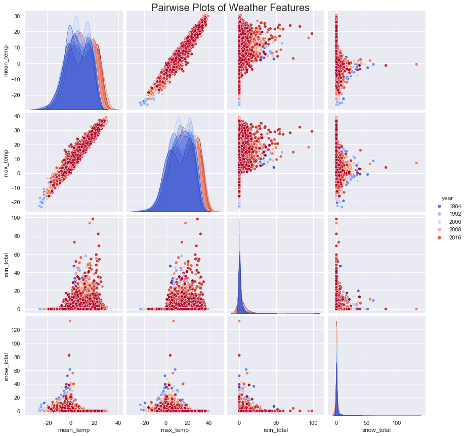
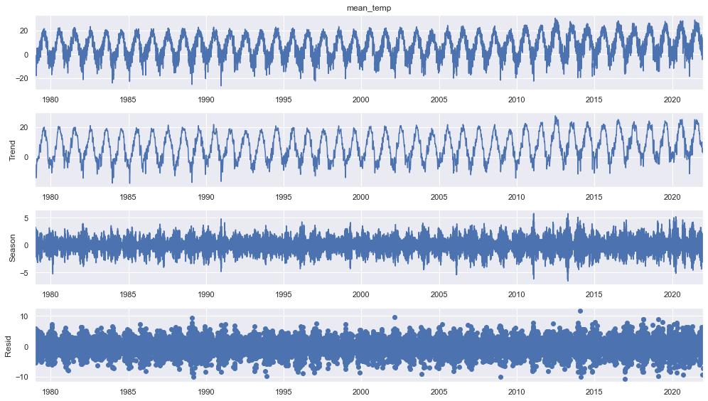

# Weather Anomaly Detection

[](https://github.com/joseph-cavarretta/weather-anomaly-detection/actions/workflows/ci.yml)

Unsupervised anomaly detection on historical weather data using Isolation Forest. The model is trained on 50 years of daily temperature data for Boulder, CO, and uses Seasonal Trend Decomposition (STL/LOESS) to isolate the residual component before fitting.

<p align="left">

</p>

## How It Works

1. Hourly temperature data (1970–2020) is resampled to daily averages
2. STL decomposition extracts the residual component (removes trend and seasonality)
3. Isolation Forest is trained on the residuals with `contamination=0.05`
4. The saved model labels new daily observations as anomalous or normal

<p align="left">

</p>

## Stack

- **scikit-learn** — Isolation Forest
- **statsmodels** — STL/LOESS seasonal decomposition
- **meteostat** — fetches new daily weather data from the nearest station
- **Docker** — containerized inference
- **Apache Airflow** — weekly scheduled runs (`weather_dag.py`)
- **Google Cloud Storage** — output archival

## Quick Start

```bash
# build the image
make build

# train the model on historical data (saves isolation_forest.pkl)
make train

# run inference on new data
make run
```

## Project Structure

```
├── Dockerfile
├── Makefile
├── requirements.txt
├── pyproject.toml
├── weather_dag.py          # Airflow DAG for weekly scheduling
├── src/
│   ├── train_model.py      # trains Isolation Forest on historical data
│   ├── weather_model.py    # loads model and labels new data
│   ├── weather_eda.ipynb   # exploratory analysis and model selection
│   └── data/
│       ├── weather_data_historical.csv.gz
│       ├── processed_weather_data_historical.csv.gz
│       └── labelled_weather_data.csv.gz
└── scripts/
    ├── build.sh
    ├── run.sh
    └── upload_to_gcs.py    # archives labelled output to GCS
```

## Environment Variables

| Variable | Description | Default |
|---|---|---|
| `DATA_DIR` | Path to input data directory | `src/data` |
| `OUT_DIR` | Path for labelled output files | `src/data/scheduled_runs` |
| `GCS_BUCKET_NAME` | GCS bucket for archival (upload script) | required |
| `WEATHER_MODEL_DIR` | Project root for Airflow DAG | `~/projects/weather-anomaly-detection` |

## Dataset

Historical weather data sourced from [Open Weather](https://home.openweathermap.org/) — hourly observations for Boulder, CO from 1970 to 2020. New daily data is pulled from the nearest Meteostat station to the historical data coordinates (40.01°N, 105.27°W).
